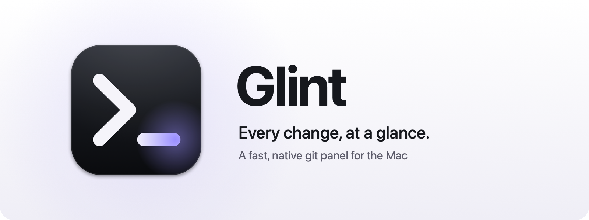
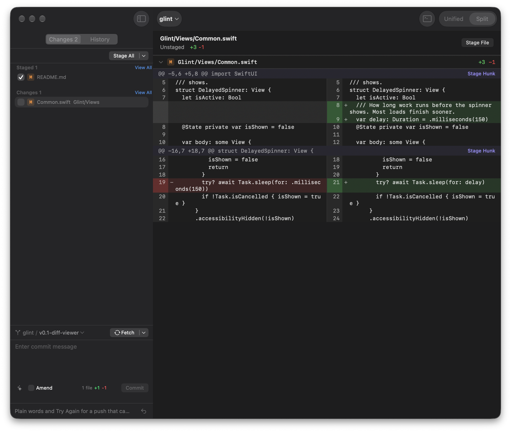
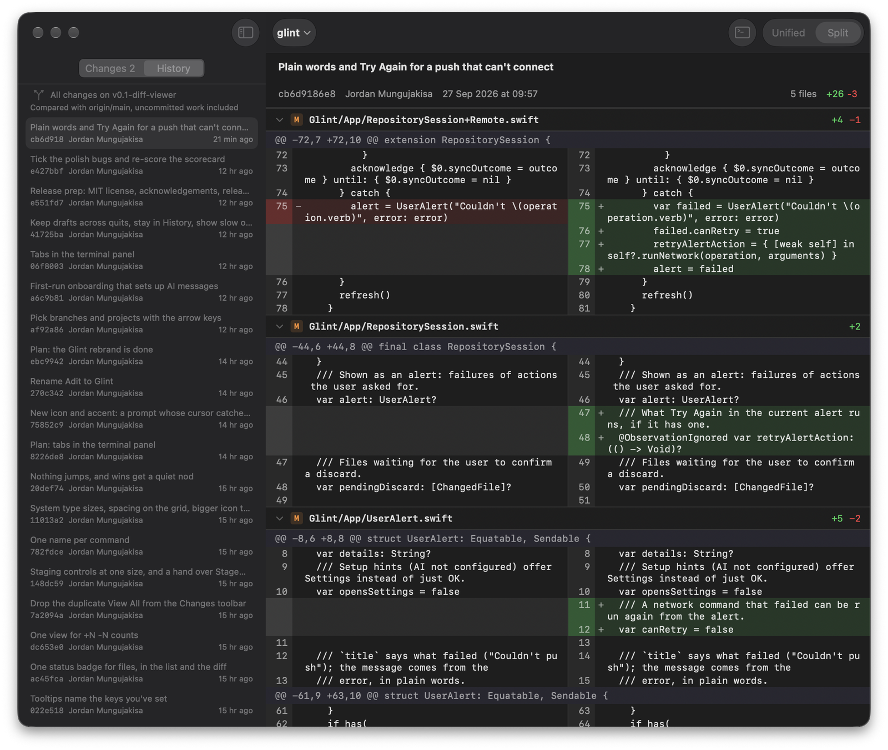

<p align="center">
  <picture>
    <source media="(prefers-color-scheme: dark)" srcset="docs/assets/banner-dark.png">
    
  </picture>
</p>

<p align="center">
  
  
  <a href="LICENSE"></a>
  <a href="https://github.com/jordan-jakisa/glint/stargazers"></a>
</p>

Glint is a small, native Mac app for the thing i do dozens of times a day: look at
what changed, stage the right bits, and commit with a message that actually says
why.

Here is the thing. Every time i wanted to read a diff, i had to open a full git
client, wait for it, and dig through branches, stashes, and remotes just to find
the one panel i came for. That is too slow for something you do this often. So i
built Glint around one rule: speed is the product. You open it, you look, you get
back to work.

<p align="center">
  
</p>

## Features

- **Your changes, live.** Every file you touch shows up as you save, with its diff
  right there, unified or side by side. Huge diffs paint their first screen at once.
- **Stage exactly what you mean.** Whole files, single hunks, or just the lines you
  pick.
- **Commit, amend, undo.** Undo puts your last commit back into staging, message
  and all.
- **Commit messages that say why.** A free AI model writes the message from your
  staged changes, and falls back to another free model when one is busy. Your diff
  is only sent when you press the sparkle button.
- **History.** Every commit's diff, plus everything on your branch compared with
  main.
- **Branches and remotes.** Switch or create branches, then fetch, pull, and push
  with your own git, so your SSH keys, hooks, and signing all just work.
- **A terminal with tabs**, right under the diff, for the commands around a commit.
- **Folders of repositories.** Open a folder that holds several repos and switch
  between them, or jump between recent projects from the title.
- **Keyboard first.** Every shortcut can be changed in Settings.

<p align="center">
  
</p>

## Install

Grab `Glint-<version>.dmg` from the
[releases page](https://github.com/jordan-jakisa/glint/releases), open it, and drag
Glint to Applications. Or with Homebrew:

```bash
brew install --cask jordan-jakisa/tap/glint
```

You need macOS 15 or later. The first time you open Glint, it walks you through
three quick steps: what it does, a free API key for the AI messages (from
[OpenRouter](https://openrouter.ai/settings/keys),
[OpenCode Zen](https://opencode.ai/docs/zen/), or
[Vercel AI Gateway](https://vercel.com/docs/ai-gateway/authentication-and-byok)),
and your first project. The key goes into your Mac's Keychain, never anywhere else.

## Keys

All of these can be changed in Settings > Shortcuts.

| Key | Does |
|---|---|
| `j` / `k` | Next / previous file or commit |
| `n` / `p` | Next / previous hunk |
| `⌘↓` / `⌘↑` | Next / previous file in the diff |
| `o` | Collapse or expand the file |
| Space | Stage or unstage the selected file |
| `s` | Stage or unstage the selected lines, or the hunk at the top |
| `c` | Write the commit message (Escape leaves it) |
| `⌘↩` | Commit |
| `⌥⌘G` | Write the commit message with AI |
| `⌘T` / `⌥⌘T` | Terminal in Glint / in your terminal app |
| `⇧⌘T` / `⌥⌘W` | New / close terminal tab |
| `⌥⌘O` | Switch to a recent project |
| `⇧⌘R`, `⌘1`–`⌘9` | Switch repository (in a folder of several) |
| `⌘B` | Switch branch |
| `⌥⌘F` / `⌥⌘P` / `⌥⇧⌘P` | Fetch / pull / push |
| `⌥⌘S` / `⌥⌘U` | Stage all / unstage all |
| `⌘\` | Unified or split |
| `⌘R` | Reload |

## Running locally

1. Clone the repository:

   ```bash
   git clone https://github.com/jordan-jakisa/glint.git
   ```

2. Open `Glint.xcodeproj` in Xcode 27 or later and press Run. Or from the
   terminal:

   ```bash
   xcodebuild -project Glint.xcodeproj -scheme Glint -configuration Debug build
   ```

3. To build a Release copy and install it to `/Applications`, run
   `scripts/install.sh`. It signs with your Apple Development certificate if you
   have one, and ad hoc if you don't, so you don't need a developer team to try it.

Run the tests with:

```bash
xcodebuild -project Glint.xcodeproj -scheme Glint test
```

## How it's built

- **SwiftUI and AppKit, Swift 6** with complete strict concurrency. The diff is an
  `NSTableView` that draws its rows directly with Core Text, so scrolling through
  thousands of lines stays smooth.
- **libgit2**, vendored in `Packages/Clibgit2`, for everything read often: status,
  history, diffs, and staging.
- **Your own git** for commit, branch switching, fetch, pull, and push, so it
  behaves exactly like your terminal.
- **SwiftTerm** for the built-in terminal.
- **Free hosted models** over an OpenAI-compatible API for commit messages.

If you want to go deeper, `docs/ARCHITECTURE.md` explains the layering and why
each piece was chosen, and `docs/DECISIONS.md` keeps the decisions and their
evidence. Releases are in `docs/RELEASING.md`.

## Contributing

Pull requests are welcome. For bigger changes, please open an issue first so we
can talk it through. Glint stays small on purpose: if a change doesn't make reading
a diff or writing a commit message faster, it probably doesn't belong.

## License

Glint is MIT licensed, see [LICENSE](LICENSE). It ships with libgit2 (GPLv2 with
the linking exception) and SwiftTerm (MIT); their licences are in
`Glint/Acknowledgements.txt` and under Help > Acknowledgements in the app.

Thank you for checking it out. If it saves you a few seconds a day, that's the
whole point.
