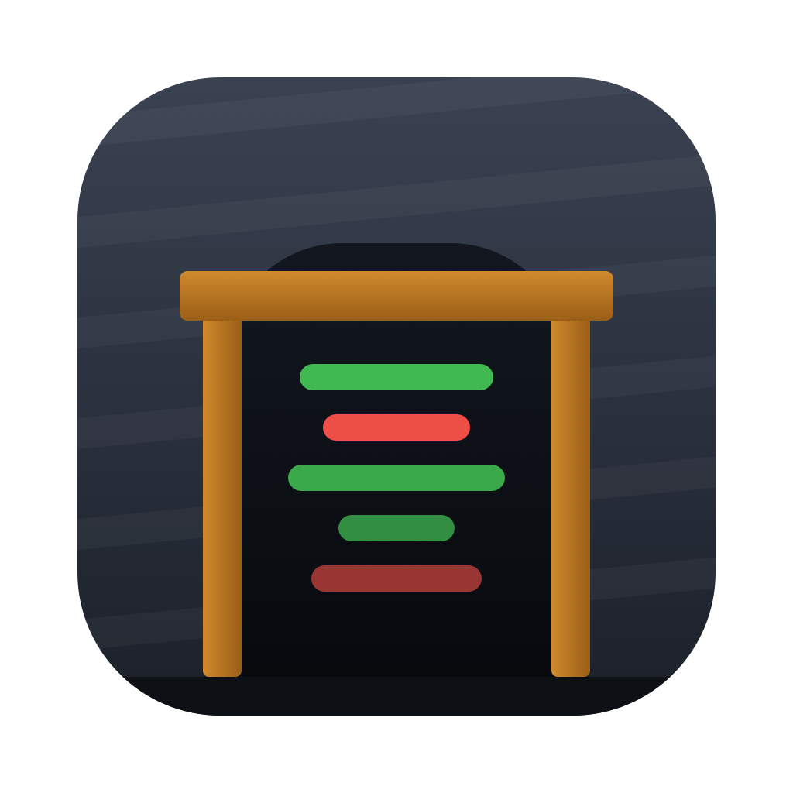

<p align="center">
  
</p>

<h1 align="center">Glint</h1>

<p align="center"><strong>Every change, at a glance.</strong></p>

A fast, native macOS git panel: read the diff, stage exactly what you mean, and
commit with a message that says why. With AI-written commit messages from free
models.

A *glint* is a quick flash of light: the one look you need to see what changed.
Glint was called Adit until 2026-09-26; it brings your settings and keys over
on first launch.

## Why this exists

Reviewing a diff and writing a commit message means leaving whatever you are doing
and opening a full git client. The existing macOS options (Tower, Fork, Sourcetree)
are repository managers: they do branching, remotes, rebasing, stashing, and the
diff is one panel among many. Glint does the two things you actually do dozens of
times a day, and nothing else:

1. Read the diff.
2. Write the commit message.

Speed is the product. If it is not instant it has failed.

## Status

Pre-v0.1. Shows your uncommitted changes and any commit's diff, unified or
split; stages files, hunks, or single lines; commits, amends, and undoes; switches
branches; fetches, pulls, and pushes; writes commit messages with free models
from OpenCode Zen, Vercel AI Gateway, or OpenRouter (set up in Settings). See
`docs/plans/v0.1-git-panel.md`.

## Keys

All of these can be changed in Settings > Shortcuts.

| Key | Does |
|---|---|
| `j` / `k` | Next / previous file or commit |
| `n` / `p` | Next / previous hunk |
| `⌘↓` / `⌘↑` | Next / previous file in the diff |
| `o` | Collapse or expand the file |
| Space | Stage or unstage the selected file |
| `s` | Stage or unstage the selected lines, or the hunk at the top |
| `c` | Write the commit message (Escape leaves it) |
| `⌘↩` | Commit |
| `⌥⌘G` | Write the commit message with AI |
| `⌘T` / `⌥⌘T` | Terminal in Glint / in your terminal app |
| `⇧⌘R`, `⌘1`–`⌘9` | Switch repository (in a folder of several) |
| `⌘B` | Switch branch |
| `⌥⌘F` / `⌥⌘P` / `⌥⇧⌘P` | Fetch / pull / push |
| `⌥⌘S` / `⌥⌘U` | Stage all / unstage all |
| `⌘\` | Unified or split |
| `⌘R` | Reload |

## Build

```bash
xcodebuild -project Glint.xcodeproj -scheme Glint -configuration Debug build
```

Or open `Glint.xcodeproj` in Xcode and press Run. To build and install to
`/Applications`, run `scripts/install.sh`; it signs with your Apple Development
certificate if you have one, so macOS keeps Keychain permissions across updates. Requires Xcode 27 or later and
macOS 15 or later. Signs ad-hoc, so no developer team is needed for local builds.

## Layout

```
Glint.xcodeproj      Xcode project. Uses a synchronized root group, so files added
                    on disk are picked up with no project-file edits.
Glint/               All app source.
docs/               Architecture, decision log, and plans.
```

## Docs

- `docs/ARCHITECTURE.md` - layering and the stack, with reasons.
- `docs/DECISIONS.md` - the decision log. Read before re-litigating a choice.
- `docs/plans/` - one file per planned release.
- `docs/BRAND.md` - name, icon, colors, and voice.
